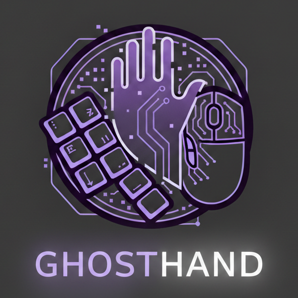

<h1 align="center">

  <br>

  [](#)
  [](#)
  [](#)

</h1>

**GhostHand** – это универсальный external-софт с набором автоматизированных макросов и скриптов для помощи во всех FPS-играх.

Проект является _external assistaint tool'ом_, который помогает в прицеливании, передвижении и т.д.

> [!WARNING]
> 🚧 **Статус проекта:** Находится в активной разработке. Весь код представлен в "сыром" виде.
> 
> ⚖️ **Disclaimer:** This project is created for educational purposes and programming practice only. The author is not responsible for any account bans or violations of Terms of Service in any games. **USE AT YOUR OWN RISK!**

> [!Important]
> Данный софт – это заскриптованная имитация ввода клавишей клавиатуры/мыши (WinAPI) и чтение пикселей экрана, поэтому какие-то функции могут работать дёргано, некорректно или вовсе мешать (в зависимости от ситуации, игры или производительности ПК).
> 
> * 👑 **Обязательно** запускайте консоль/IDE от имени **Администратора**.
> * 🪟 В играх используйте режим экрана _"Полноэкранный в окне" (Borderless)_ или _"Оконный"_. В эксклюзивном Fullscreen оверлей и чтение экрана работать не будут!

## 🧩 Функционал

<p align="center">
  
</p>

Функции включаются через чекбоксы в GUI. У каждой функции есть свои настройки (ползунки) и бинды (вкладка `Keybinds`).

### 🔫 Aim Assist (Помощь в стрельбе)
* AimPull – Color Aimbot. Плавно тянет прицел к заданному цвету с заданной скоростью.
  * FOV Circle – Оверлей поверх экрана, показывающий радиус работы AimPull (можно менять цвет).
* Pixel Trigger Bot – Автоматический выстрел при изменении пикселей в центре прицела (реакция на появление врага).
* Mini-Recoil Control – Лёгкий макрос, тянущий прицел вниз при зажатии `ЛКМ` (для компенсации отдачи).
* Autopistol – Автоматический спам ЛКМ при удержании кнопки.

### 🚫🎯 Anti-Aim (Защита от headshot'а)
* Flick Anti-Aim – Резкий отвод камеры в сторону и обратно для "поломки" хитбоксов головы на сервере. Можно регулировать скорость, угол поворота, включение/выключение по кнопке `F` (toggle).

### 🏃 Movement (Передвижение)
* Bhop – Классический баннихоп (спам пробела) с настройкой задержек и рандомизацией таймингов для скрытности.
* Snap Tap – Приоритет последнего нажатия клавиш `A`/`D` (быстрая смена направления движения).

### 🎨 Visuals (Внешний вид)
* Watermark – Стильная плашка в углу экрана со статусом софта и временем.
* UI Scale – Изменение размеров окна и интерфейса (для всех мониторов и разрешений экранов).  

### ⭐ Misc (Разное)
* Anti-AFK – Автоматическое нажатие `WASD` раз в несколько секунд, чтобы сервер не кикнул за бездействие.
* FastZoom – Макрос для снайперских винтовок (Прицел -> Выстрел -> Быстрый свап нажатием `Q` -> Снова `Q`, который можно отключить).
* 180°-turn – Моментальный разворот камеры на 180 градусов (настраивается под любую сенсу).
* Global Pause (Panic Key) – Мгновенная блокировка всех функций одной кнопкой (Pause).

## 🎮 Совместимость с играми
Так как софт использует WinAPI, теоретически он будет работать **везде**. Ниже список протестированных игр (он будет пополняться):
<details>
  <summary>🤝 Список проверенных игр </summary>
  <br>

  **:accessibility: Полная совместимость** _(корректно работает бо́льшая часть функций)_:
  *  Marathon *(ez BattleEye)*
  *  CS 1.6 *(ez old vac)*
  *  CS:S *(ez vac)*
  *  CS:GO *(ez vac)*
  *  Redmatch 2 *(ez enforcer)*
  *  BLOCKPOST LEGACY *(ez in-game AC)*
  *  Left 4 Dead **+** Left 4 Dead 2 *(ez vac)*
  *  Half-Life 1
  *  Postal 2 Multiplayer
  *  Deathmatch Classic
  *  Half-Life Deathmatch: Source
  *  TF Classic
  *  Serious Sam 3: BFE

  **:feelsgood: Только в Secured-режиме** _(высокий риск детекта античитом за какие-то функции)_:
  *  CS 2 **(bad for VACNET)**
  * Некоторые прочие игры с Vanguard / EAC / BattlEye.

  **:speak_no_evil: Скорее бесполезно, чем полезно** _(полезна лишь малая часть функций)_:
  *  Deadlock
</details>

## 🚀 Установка и запуск
Пока софт находится в **разработке** и запустить его можно только следующим образом:

1. Склонируйте репозиторий
  ```bash
  git clone https://github.com/n1xsi/ghosthand.git
  cd ghosthand
  ```
2. Установите необходимые библиотеки (рекомендуется использовать виртуальное окружение venv):
  ```bash
  pip install dearpygui mss numpy keyboard
  ```
3. Запустите в IDE/CMD главный файл от имени Администратора:
  ```bash
  python main.py
  ```

## ⚙ Стек технологий
* [Python 3.12.12](https://www.python.org/downloads/release/python-31212/) – язык программы
* [DearPyGui](https://dearpygui.readthedocs.io/) – быстрый GPU-ускоренный интерфейс
* [ctypes (WinAPI)](https://docs.python.org/3/library/ctypes.html) – низкоуровневая эмуляция клавиатуры/мыши через SendInput
* [threading](https://docs.python.org/3/library/threading.html) – многопоточность для считывания разных клавиш
* [mss](https://python-mss.readthedocs.io/stable/) & [numpy](https://numpy.org/doc/stable/user/index.html#user) – cверхбыстрый захват экрана и матричные вычисления для AimPull
* [tkinter](https://docs.python.org/3/library/tkinter.html) – gрозрачные Click-Through оверлеи поверх экрана
